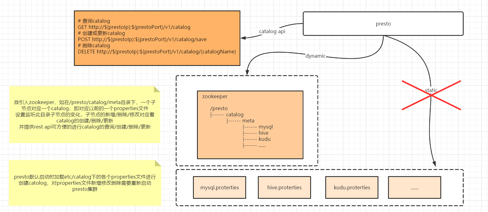
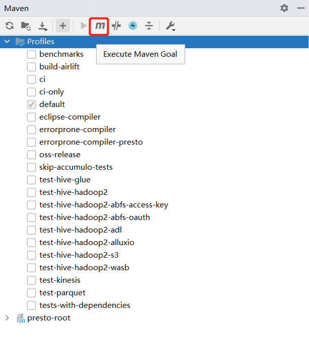
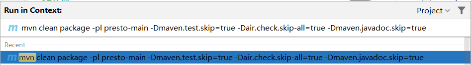
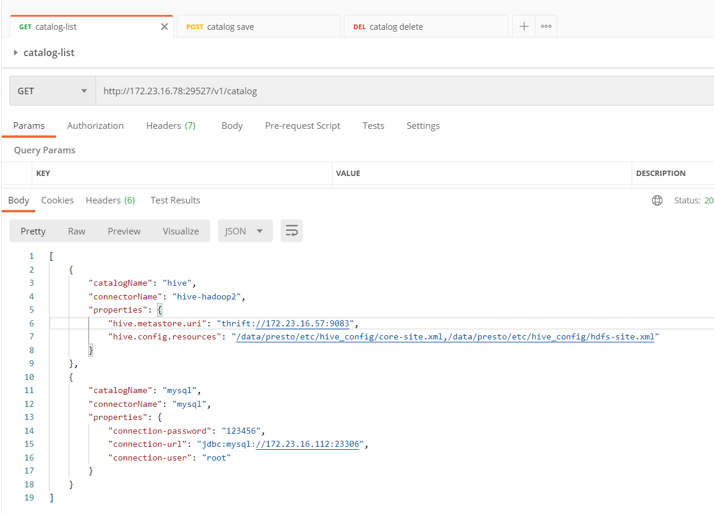
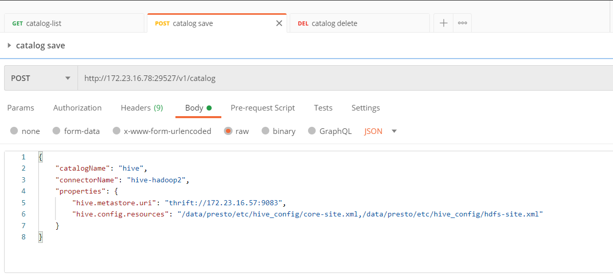
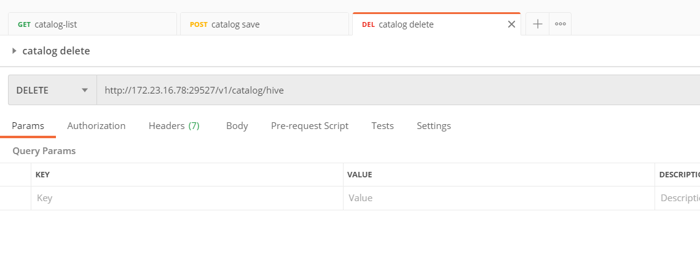

# Presto

## 1. presto的docker安装

先运行一次，然后从容器中将配置文件和插件都拷贝到主机，方便后续修改
```
docker run --name presto -p 29527:8080 -d prestosql/presto:345

docker cp presto:/usr/lib/presto/default/etc /data/presto
docker cp presto:/usr/lib/presto/plugin /data/presto

# 后续会替换此jar包，对presto做二开
docker cp presto:/usr/lib/presto/lib/presto-main-345.jar /data/presto
# 做个备份
cp /data/presto/presto-main-345.jar /data/presto/presto-main-345.jar.original
```

> start.sh

这里的19565的jvm运行的port，可以本地进行远程debug，方便调试

需要在presto的jvm.config追加一行，jdk11写法

```
-agentlib:jdwp=transport=dt_socket,server=y,suspend=n,address=*:19565
```

```
#!/bin/bash
docker stop presto
docker rm presto
docker create --restart always --name presto \
-v `pwd`/data:/data/presto \
-v `pwd`/etc:/usr/lib/presto/etc \
-v `pwd`/plugin:/usr/lib/presto/plugin \
--add-host=hdspdev004.hand-china.com:172.23.16.60 \
-p 29527:8080 \
-p 29528:19565 \
prestosql/presto:345
docker cp /data/presto/presto-main-345.jar presto:/usr/lib/presto/lib
docker start presto
```

> 目录结构

```
[root@hdspdemo009 presto]# pwd
/data/presto
[root@hdspdemo009 presto]# ll
total 1017484
drwxrwxrwx  3 root root       4096 Oct 30 17:00 data
drwxr-xr-x  3 root root       4096 Oct 24 03:06 etc
drwxr-xr-x 40 root root       4096 Oct 24 02:25 plugin
-rwxrwxrwx  1 root root        210 Oct 30 16:57 start.sh
```
## 2. 配置

### 2.1 新增mysql catalog

> https://prestosql.io/docs/current/connector/mysql.html

```
[root@hdspdemo009 catalog]# pwd
/data/presto/etc/catalog
[root@hdspdemo009 catalog]# vi mysql.properties
connector.name=mysql
connection-url=jdbc:mysql://172.23.16.112:23306
connection-user=root
connection-password=123456
```
### 2.2 新增hive catalog

> https://prestosql.io/docs/current/connector/hive.html

```
[root@hdspdemo009 catalog]# pwd
/data/presto/etc/catalog
[root@hdspdemo009 catalog]# vi hive.properties
connector.name=hive-hadoop2
hive.metastore.uri=thrift://172.23.16.57:9083
hive.config.resources=/data/presto/etc/hive_config/core-site.xml,/data/presto/etc/hive_config/hdfs-site.xml
```

core-site.xml，hdfs-site.xml是hive主机上的Hadoop配置文件，一般在/etc/hadoop目录下，将这两个文件拷贝docker容器中，hive.config.resources 对应的值就是容器中这两个文件的路径

注：如果在真实环境中，配置文件用主机名代替了ip，还要在容器中配置主机映射。不然无法识别主机名。并且docker重启后，之前配置的主机映射会消失，需要重新配置。

如果查询的时候显示无法访问xxxx.db文件，说明是连接所使用的用户没有权限，默认情况下，Presto将使用Presto进程的OS用户访问HDFS(即系统用户)。

例如，如果Presto以root身份运行，它将以身份访问HDFS的权限为root用户的权限。

要解决这个问题就要在presto的jvm.config文件中配置访问的用户，在jvm.config中添加：```-DHADOOP_USER_NAME=hdfs```

## 3. 使用

> 简单测试

```
[root@hdspdemo009 ~]# docker exec -it presto presto
presto> select * from mysql.hdsp_core.xcor_sys_config AS a left join hive.terry.test_partition_sq AS b on a.config_id = b.id;
Query 20201030_094116_00000_dbrxh failed: Presto server is still initializing

presto> select * from mysql.hdsp_core.xcor_sys_config AS a left join hive.terry.test_partition_sq AS b on a.config_id = b.id;
 config_id |    config_code     |     config_name      |  config_description  | enabled_flag | tenant_id | object_version_number |      creation_date      |
-----------+--------------------+----------------------+----------------------+--------------+-----------+-----------------------+-------------------------+-
         1 | backup             | 备份设置             | 备份相关配置         |            1 |         0 |                     1 | 2020-09-05 13:29:30.000 |
```

> ui界面
>
> http://172.23.16.78:29527

## 4. presto热加载catalog

presto二开



拉取本项目，切换到dynamic-catalog-zk3.4.x分支

大多开发者本地都安装的是java8，这里可以使用idea自行下载java11，然后使用idea maven的execute maven goal执行如下命令，若本地就是java11，直接执行即可





```
mvn clean package -pl presto-main -Dmaven.test.skip=true -Dair.check.skip-all=true -Dmaven.javadoc.skip=true
```

打包后生成的presto-main-345.jar替换presto集群中每个节点的presto-main-345.jar

### 4.1 配置文件修改

```
[root@hdspdemo009 presto]# cd etc/
[root@hdspdemo009 etc]# ll
total 24
drwxr-xr-x 2 root root 4096 Oct 30 17:13 catalog
-rw-r--r-- 1 root root  178 Nov  6 16:37 config.properties
drwxr-xr-x 5 root root 4096 Oct 30 17:29 hive_config
-rw-r--r-- 1 root root  469 Nov  4 16:59 jvm.config
-rw-r--r-- 1 root root   56 Oct 30 17:08 log.properties
-rw-r--r-- 1 root root  298 Nov  6 16:15 node.properties
```

修改node.properties，增加额外配置
> node.properties

```
node.environment=docker
node.data-dir=/data/presto

# extra
catalog.zk.address=172.23.16.70:2181,172.23.16.71:2181,172.23.16.72:2181
catalog.zk.namespace=presto
catalog.zk.path=/catalog/meta
```

* catalog.zk.address
    - catalog注册的zookeeper地址
* catalog.zk.namespace
    - namespace, 默认为presto，做数据隔离使用
* catalog.zk.path
    - catalog的储存node path，默认为catalog/meta，最终path=catalog.zk.namespace/catalog.zk.path，即默认为presto/catalog/meta

### 4.2 Catalog Rest API

> get catalog list



> create or update



- mysql demo

```
{"catalogName":"mysql","connectorName":"mysql","properties":{"connection-password":"123456","connection-url":"jdbc:mysql://172.23.16.112:23306","connection-user":"root"}}
```

- hive demo

```
{"catalogName":"hive","connectorName":"hive-hadoop2","properties":{"hive.metastore.uri":"thrift://172.23.16.57:9083","hive.config.resources":"/data/presto/etc/hive_config/core-site.xml,/data/presto/etc/hive_config/hdfs-site.xml"}}
```

> delete catalog




